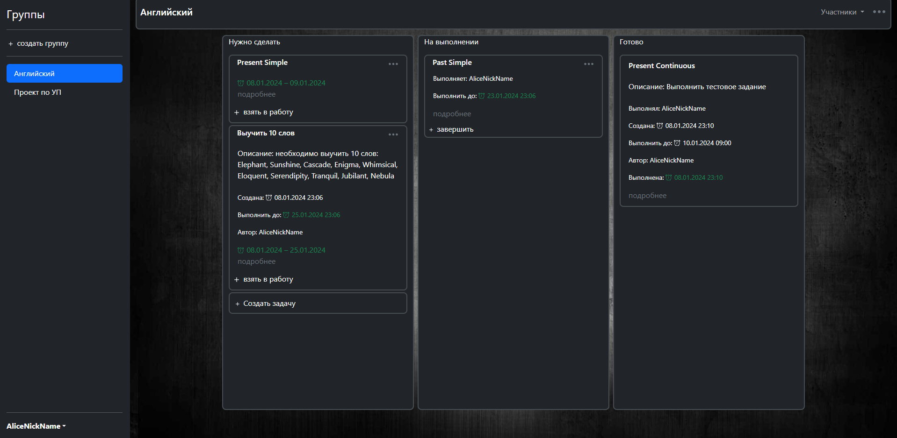
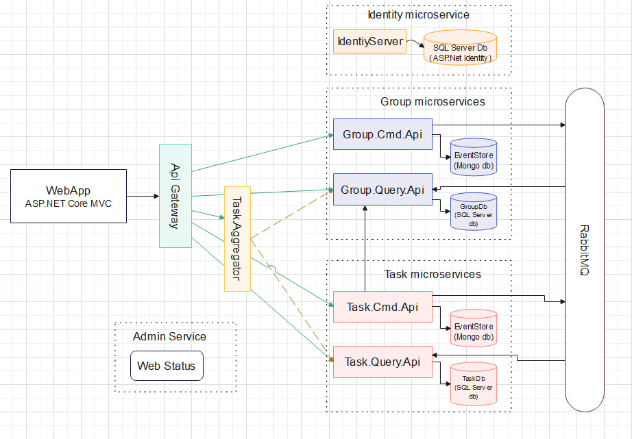

# TaskTracker

Данный проект представляет собой веб-платформу, которая позволяет арендовать игровые аккаунты для игровых приставок. С помощью этой платформы пользователи имеют возможность легко находить доступные аккаунты, выбирать игры, а также арендовать их на определенный период времени.

 

## Архитектура 
 Данный проект реализует микросервисную архитектуру с использованием паттернов CQRS (Command Query Responsibility Segregation) и Event Sourcing и поддерживает асинхронную связь для передачи событий с использованием брокера сообщений (RabbitMQ). Проект развертывается в Docker контейнерах с использованием docker-compose.

 


## Технологии (Backend)

- .NET7
- ASP.Net Core WebApi
- ASP.Net Core MVC
- RabbitMQ
- MassTransit
- Entity Framework Core
- MSSQL
- MongoDb
- Duende IdentityServer
- ASP.Net Identity
- MediatR
- Ocelot
- AspNetCore.HealthChecks

## Технологии (Frontend)

- Html/Css
- JS
- Bootstrap
- JQuery

## Запуск проекта

- Для запуска необходимо установить и настроить Docker 
- Клонировать проект: https://github.com/Vova-Tciulin/TaskTracker.git
- Открыть через консоль папку TaskTracker/ и ввести команды:

```powershell
docker-compose build
docker-compose up -d
```
- После запуска всех контейнеров проект будет доступен по следующему URL:

```http://localhost:8010/
```
## URLs микросервисов: 

- WebApp -> http://localhost:8010/
- Web Status -> http://localhost:8011/
- TaskTracker.Aggregator -> http://localhost:8006/swagger/index.html
- IdentityServer -> http://localhost:8080/
- Group.Cmd.Api -> http://localhost:8003/swagger/index.html
- Group.Query.Api -> http://localhost:8004/swagger/index.html
- Task.Cmd.Api -> http://localhost:8001/swagger/index.html
- Task.Query.Api -> http://localhost:8002/swagger/index.html
- Rabbit Management Dashboard -> http://localhost:15672/ -- guest/guest
- Portainer -> http://localhost:9000/ -- admin/admin1234


